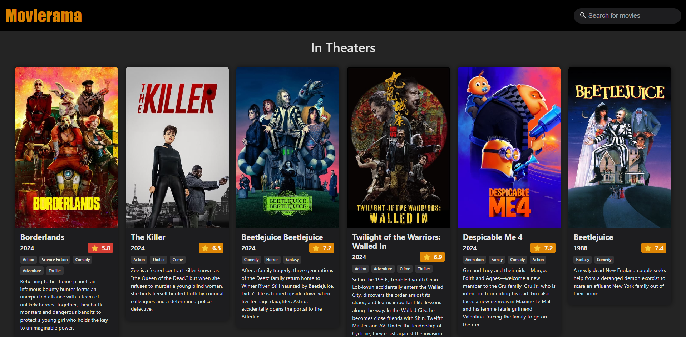
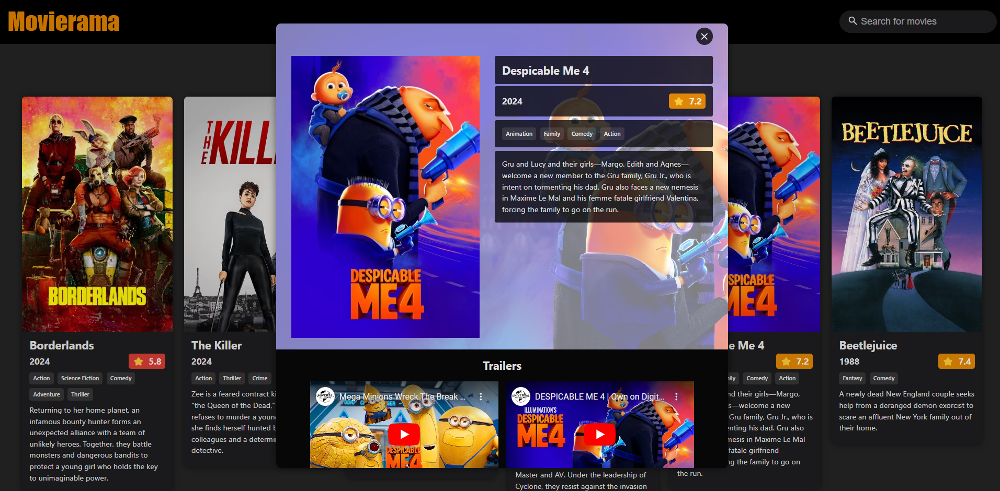
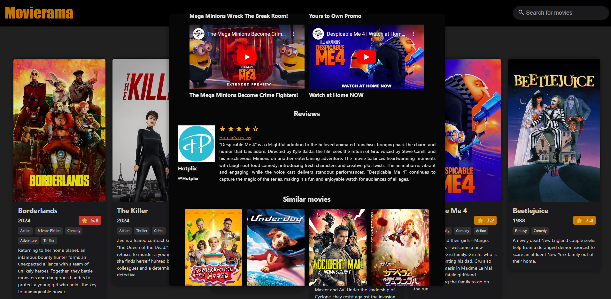
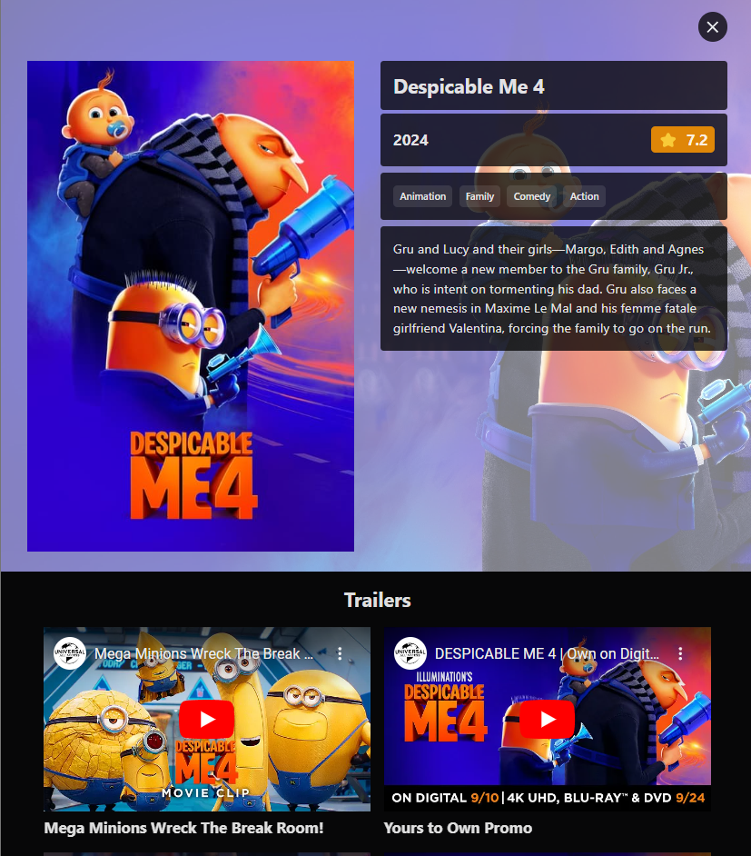
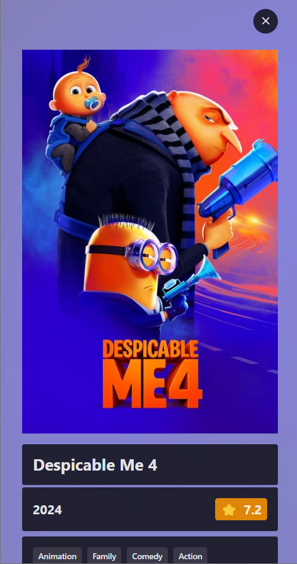
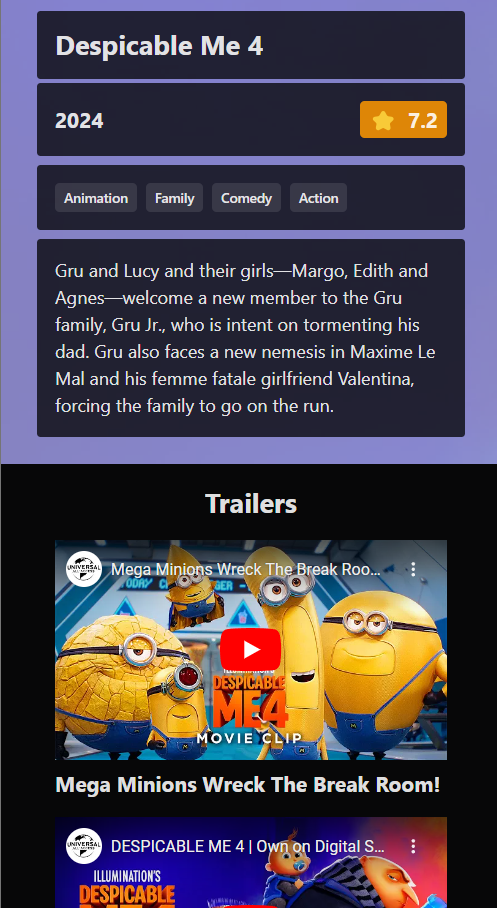
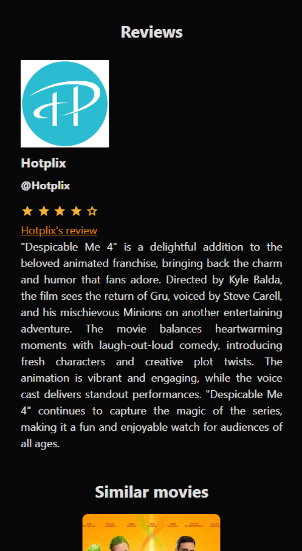
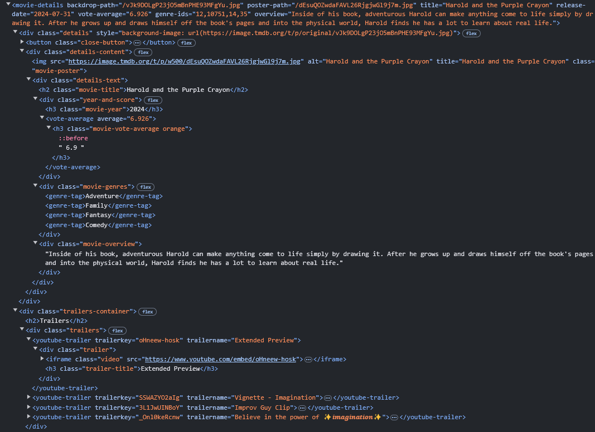

# Movierama

## Table of Contents

- [Overview](#overview)
- [Features](#features)
- [Screenshots](#screenshots)
- [Responsive Design](#responsive-design)
- [Accessibility](#accessibility)
- [Technical Decisions](#technical-decisions)
  - [Use of TypeScript instead of JavaScript](#1-use-of-typescript-instead-of-javascript)
  - [Use Vite/Vitest as bundling tool/testing framework](#2-use-vitevitest-as-bundling-tooltesting-framework)
  - [Use of the Web Components standard for creating reusable custom elements](#3-use-of-the-web-components-standard-for-creating-reusable-custom-elements)
- [Challenges](#challenges)
  - [Testing the components (before implementing custom elements)](#1-testing-the-components-before-implementing-custom-elements)
- [Future Improvements](#future-improvements)
- [Installation](#installation)
- [Contributing](#contributing)
- [License](#license)

## Overview

Movierama is yet another movie catalog where users can check the movies of the week, search for movies and view details about them. The project doesn't have any backend parts but instead relies solely on [The Movie DB (TMDB)](https://www.themoviedb.org/) JSON [API](https://developer.themoviedb.org/docs/getting-started) for a data source. The application is built using TypeScript, HTML5, and CSS3. 

## Features

- **In Theaters**: Find a list of movies currently being played in cinemas.
- **Movie Discovery**: Browse through a wide range of movies and explore detailed information about each movie, including overview, trailers, reviews, and ratings.
- **Keyword Search**: Type in the search bar to filter through TMDB's huge catalog of movies.
- **YouTube Trailers**: Find trailers and watch them right inside the app.
- **User Reviews**: Read user reviews for any movie.
- **Similar Movies**: Each movie has its own suggested list of similar movies.
- **Infinite Scrolling**: Just scroll down and the movies keep coming.

## Screenshots

|  |  |  |
|-------------------------------------------------------------|---------------------------------------------------------------|-------------------------------------------------------------|

## Responsive Design

The app is designed with responsiveness in mind, ensuring it delivers an optimal user experience across various devices and screen sizes. By utilizing responsive design techniques, such as flexible layouts, media queries, and scalable components, the interface adapts seamlessly to different resolutions, from mobile phones to desktop screens. This approach ensures that content remains accessible and easy to interact with, regardless of the user's device.

## Accessibility

The app employs `rem` units instead of pixels (`px`) to enhance accessibility and improve scalability. Unlike pixels, which are fixed units, `rem` units are relative to the root font size, typically set by the user’s browser settings. This allows users who adjust their default font size for better readability—such as individuals with visual impairments—to experience a more accessible interface. By using rem, the app's layout and text scale proportionally, ensuring that all elements remain legible and usable regardless of the user's device settings or personal preferences. This approach promotes a more inclusive user experience and aligns with best practices for responsive and accessible web design.

## Technical Decisions

### 1. Use of TypeScript instead of JavaScript

TypeScript was chosen over JavaScript to leverage its robust type-safety features. While it does require some learning, even for seasoned JavaScript developers, TypeScript significantly enhances the coding experience. Its strongly typed nature helps prevent bugs that might otherwise go unnoticed, and the built-in auto-completion features in most IDEs streamline development, making the code more predictable and reducing errors. Ultimately, TypeScript improves code reliability and productivity by providing a safer and more efficient development environment.

### 2. Use Vite/Vitest as bundling tool/testing framework

Vite and Vitest were chosen as part of the development stack to complement the use of TypeScript and a modular code structure. Vite, known for its blazing-fast build times and native support for modern JavaScript features, integrates seamlessly with TypeScript, making it ideal for managing a project split into modules. Its lightning-fast hot module replacement (HMR) enhances the development experience by ensuring quick feedback when working across different modules. Additionally, Vite’s efficient bundling process simplifies managing a TypeScript project by optimizing build performance and reducing overhead.

Vitest, designed to work smoothly with Vite, was selected as the testing framework for its compatibility with TypeScript and ability to handle module-based architectures. It offers quick test execution with native support for TypeScript, which allows for consistent type-checking across both the application code and the test suite. This ensures that errors are caught early, and the tests remain tightly integrated with the development process, especially when dealing with a project structured into separate, self-contained modules. Together, Vite and Vitest provide a streamlined, efficient, and highly performant ecosystem for developing and testing TypeScript-based modular projects.

### 3. Use of the [Web Components](https://developer.mozilla.org/en-US/docs/Web/API/Web_components) standard for creating reusable custom elements

HTML [&lt;template&gt; elements](https://developer.mozilla.org/en-US/docs/Web/API/Web_components/Using_templates_and_slots) were initially used to define the structure of various components inside the main `index.html` file, while the logic governing each component was maintained in individual TypeScript (TS) files. This approach centralizes the component's structure in one place for reusability while ensuring the component logic is modular and isolated. 

An alternative approach was to embed the HTML code for each component directly within its respective TypeScript file. This method would enable a more self-contained component structure, where both the logic and the layout are bundled together in a single file. By keeping the HTML within the TypeScript, it enhances component encapsulation, making each component easier to move, reuse, or refactor. This approach also aligns well with modern component-based frameworks, where templates and logic are often co-located, improving code organization and reducing context switching during development.

In a complete rewrite of the components, the HTML &lt;template&gt; elements were removed and [custom elements](https://developer.mozilla.org/en-US/docs/Web/API/Web_components/Using_custom_elements) were used to enhance modularity and reusability. By leveraging the CustomElementsRegistry, each component is now defined as a self-contained custom element, encapsulating its structure. This transition to custom elements allows for better separation of concerns, more maintainable code, and reusable components that can be easily tested and integrated across different parts of the app. Additionally, this approach aligns with modern web standards, ensuring future compatibility and better performance, as well as offering built-in support for features like shadow DOM, which helps isolate styles and scripts within each component.

## Challenges

### 1. Testing the components (before implementing custom elements)

The use of HTML &lt;template&gt; elements made writing tests for the various components more difficult as the creation of specific containers and elements was needed prior to running the app logic. 

For example calling `app.appendMovies(...)` requires a container with the class `.results` to exist where the MovieCard components can be appended as children, while the creation of the MovieCard component itself requires the existence of a &lt;template&gt; element with the id `#movie-card`. 

Fortunately, rewriting the components as custom elements improved the testability, if not of the entire application at least of each individual component. 

## Future Improvements

1. **Filtering the results by genre** (new feature): A list of all the genres can help the users filter their search results (or the movies that are now "In Theaters") by genre. Clicking on a genre tag can reset the search input while also applying the filter, thus showing all movies of the selecred genre.

2. **Add carousels** (new feature): More trailers and similar movies (now limited at 4) could be shown if a carousel was employed. The users could navigate using arrows on the left and right of the screen, or by swiping on mobile devices. 

3. **Clear the search input** (new feature): Add an X button inside the search input that when clicked will clear any search terms and reset the search results. 

## Installation

To get started with Movierama, follow these steps:

1. Clone the repository: `git clone https://github.com/felagund1789/Frontend-MovieRama-KonstantinosKokordelis.git`.
2. Run `npm install` to install the required dependencies.
3. Get a TMDB API key at [https://www.themoviedb.org/settings/api](https://www.themoviedb.org/settings/api). You'll have to create an account first.
4. Copy `.env.example` to `.env` and replace the value of `VITE_TMDB_API_KEY=YOUR_API_KEY` with your own key
5. Run `npm run dev` to start the web server.
6. Open your browser and visit `http://localhost:5173` to access Movierama.

## Contributing

Contributions are welcome! If you have any ideas, suggestions, or bug reports, please open an issue or submit a pull request. Here's how you can contribute:

1. Fork the repository on GitHub.
2. Clone your forked repository to your local machine.
3. Create a new branch for your changes.
4. Make your desired changes to the codebase.
5. Commit and push your changes to your forked repository.
6. Submit a pull request to the original repository.

Please ensure that your contributions adhere to the project's coding conventions and guidelines. Also, make sure to provide a clear and detailed description of your changes in the pull request.

Thank you for your interest in contributing to Movierama!

## License

This project is licensed under the [MIT License](LICENSE).
